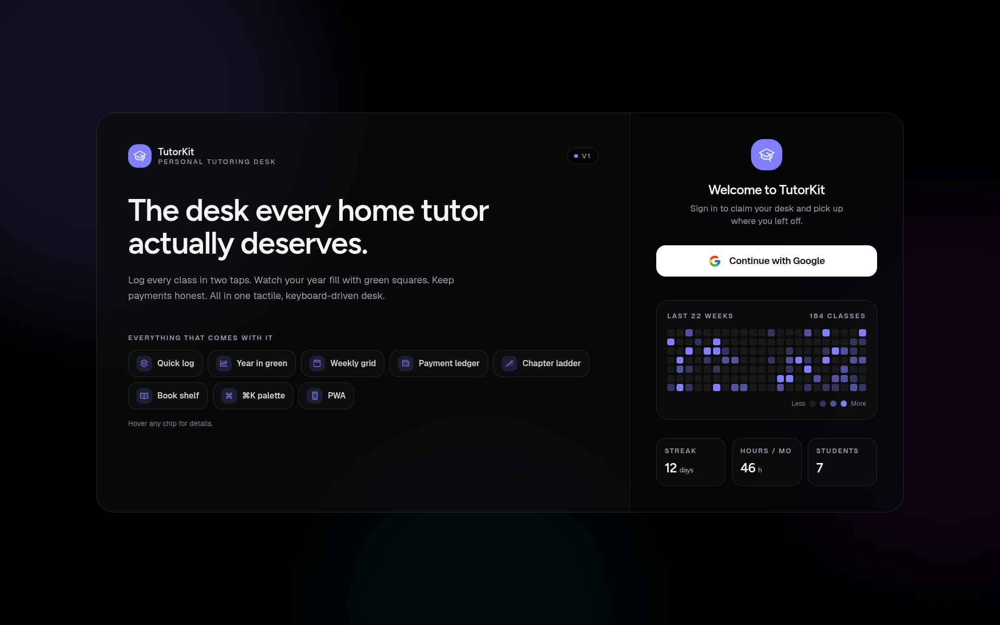

# TutorKit

> Personal tutoring desk: classes, schedules, payments, contribution heat-map.



A single-user PWA built for home tutors who want a tactile, keyboard-driven command center instead of a generic CRM. Log a class in two taps, see your year-long GitHub-style activity graph, watch each student climb their chapter ladder, and keep payment history honest — synced across all your devices.

**Live:** [https://tutorkit.web.app](https://tutorkit.web.app)

---

## Features

- **Year-long contribution graph** — GitHub-style heat-map of every class you've taught.
- **Quick Log sheet** — log a class in one keystroke (`N`), pick multiple subjects + chapters per class, mark chapters done, attach homework.
- **Roster + chapter ladder** — every student has a colored gradient avatar, assigned subjects, and a chapter ladder that fills in as you teach.
- **Library** — subjects, chapters, per-chapter materials (links, notes, files), and textbook URLs.
- **Weekly schedule grid** — recurring slots rendered on a 7-day timeline, color-coded per student.
- **Payment ledger** — log payments per student, see month-by-month totals, outstanding balances.
- **Stats page** — total minutes taught, current streak, top student, top subject, per-subject breakdown.
- **Homework + revision queue** — surfaces what's due next on the Today screen.
- **Command palette** — `Cmd/Ctrl + K` to jump anywhere or run any action.
- **Google sign-in + cloud sync** — your data lives in a private per-user document, with offline support via IndexedDB.
- **PWA** — installable from Chrome/Safari, offline-capable via service worker, custom maskable icons.
- **Mobile-first shell** — hamburger drawer, touch-friendly chips, responsive grids.
- **Onboarding tour** — a short guided walkthrough on first sign-in (replay anytime from `?` in the top bar).

## Tech stack

- **Next.js 16** App Router, static export
- **React 19**, **TypeScript 5**
- **Tailwind CSS v4** with OKLCH design tokens
- **shadcn/ui** components (radix primitives, customized)
- **Zustand** for client state, `localStorage` persistence
- **Firebase** — Google Auth + Firestore (with IndexedDB offline persistence)
- **Turborepo** monorepo, npm workspaces
- **GitHub Actions** → auto-deploy on every push to `main`

## Project structure

```
.
├── apps/
│   └── web/                       # Next.js app (the only deployable)
│       ├── app/                   # App Router pages
│       │   ├── page.tsx           # Today / dashboard
│       │   ├── students/          # Roster listing
│       │   ├── student/           # /student?id=… detail (query-param for static export)
│       │   ├── schedule/, payments/, sessions/, stats/, library/
│       │   └── layout.tsx         # Root shell, theme, PWA + OG metadata
│       ├── components/
│       │   ├── shell/             # AppShell, Sidebar, Topbar, QuickLog, CommandPalette, InstallPrompt
│       │   ├── students/          # StudentCard, ChapterLadder, StudentDialog
│       │   ├── library/           # ChapterDetailSheet (materials + session timeline)
│       │   ├── tour/              # Onboarding spotlight tour
│       │   ├── sessions/          # SessionFeed, SessionRow
│       │   ├── graph/             # ContributionGraph
│       │   └── ui-bits.tsx        # SubjectMark, StudentAvatar, Pill, Panel
│       ├── lib/
│       │   ├── firebase.ts        # Firebase init + Google sign-in
│       │   ├── auth.tsx           # AuthProvider + useAuth
│       │   ├── sync.ts            # useFirestoreSync hook (bi-directional)
│       │   ├── store.ts           # Zustand store
│       │   ├── tutoring-data.ts   # Types (Student, SessionNote, SessionItem, Payment, Subject)
│       │   ├── tutoring-storage.ts# localStorage layer + legacy-key migration
│       │   └── derive.ts          # Derived selectors (streak, totals, progress)
│       └── public/                # PWA icons, manifest, service worker, og.png
├── packages/
│   ├── ui/                        # @workspace/ui — shadcn components shared across apps
│   ├── eslint-config/
│   └── typescript-config/
├── scripts/
│   └── gen-pwa-icons.mjs          # Regenerate icon-{192,512,maskable-512}.png from a source
├── .github/workflows/
│   └── firebase-hosting-deploy.yml# CI → build static export → deploy
├── firebase.json, .firebaserc
├── firestore.rules                # Per-user document isolation
└── turbo.json, package.json       # Monorepo wiring
```

## Local setup

Prereqs: **Node 20+**, **npm 11+** (the repo pins `npm@11.6.2` via `packageManager`).

```bash
git clone https://github.com/bokaif/tutorkit.git
cd tutorkit
npm install
```

### Environment

Copy the example file and fill in your own Firebase web config:

```bash
cp apps/web/.env.example apps/web/.env.local
```

```bash
# apps/web/.env.local — all PUBLIC by design; Firestore rules enforce auth.
NEXT_PUBLIC_FIREBASE_API_KEY=…
NEXT_PUBLIC_FIREBASE_AUTH_DOMAIN=<project>.firebaseapp.com
NEXT_PUBLIC_FIREBASE_PROJECT_ID=<project>
NEXT_PUBLIC_FIREBASE_STORAGE_BUCKET=<project>.firebasestorage.app
NEXT_PUBLIC_FIREBASE_MESSAGING_SENDER_ID=…
NEXT_PUBLIC_FIREBASE_APP_ID=…
```

Grab these from **Firebase Console → Project settings → Your apps → Web app**.

Enable **Google** as a sign-in provider under Authentication → Sign-in method.

If you skip the env file the app still runs — it falls back to `localStorage`-only mode (the sidebar badge will read `Local only`).

### Run

```bash
npm run dev            # Next.js dev server with Turbopack on :3000
npm run typecheck      # tsc --noEmit across the workspace
npm run lint           # eslint across the workspace
npm run build          # static export → apps/web/out/
```

## Deployment

Every push to `main` triggers `.github/workflows/firebase-hosting-deploy.yml`, which typechecks, builds the static export, and deploys `apps/web/out/`.

#### Required GitHub Actions secret

| Secret | What it is |
|---|---|
| `FIREBASE_SERVICE_ACCOUNT_TEACH101_APP` | JSON service-account key with hosting deploy permissions. |

#### Manual deploy

```bash
npm run build
firebase deploy --only hosting --project teach101-app
```

## Data model

```ts
type Student = {
  id: string
  name: string
  color: string                    // hex; drives gradient avatar
  assignedSubjectIds: string[]
  scheduleSlots?: { dayOfWeek: number; startTime: string; durationMin: number }[]
  chapterProgress: Record<string, Record<number, ProgressStatus>>
  monthlyFee?: string
  classesPerPayment?: string
}

type SessionItem = { subjectId: string; chapterIndex: number }

type SessionNote = {
  id: string
  studentId: string
  subjectId: string                // mirrors items[0] for back-compat
  chapterIndex: number             // mirrors items[0] for back-compat
  items?: SessionItem[]            // source of truth for multi-subject classes
  note: string
  tags?: string[]
  homework?: string
  durationMin?: number
  date: string                     // YYYY-MM-DD
}

type Subject = {
  id: string
  code: string
  name: string
  bookFile: string                 // URL to primary textbook / PDF
  chapters: string[]
}

type Material = {
  id: string
  kind: "link" | "note" | "file"
  title: string
  url?: string
  body?: string
}
```

State lives in a Zustand store (`apps/web/lib/store.ts`) hydrated from `localStorage`. When Firebase is configured, `useFirestoreSync` mirrors the entire bag into a single document at `users/{uid}`.

## Firestore security

Google Auth gives each tutor a stable uid. The rules in `firestore.rules` restrict reads/writes so only the owner can touch their own document:

```ts
match /users/{uid} {
  allow read, write: if request.auth != null && request.auth.uid == uid;
}
```

Deploy rule changes with:

```bash
firebase deploy --only firestore:rules --project teach101-app
```

## Keyboard shortcuts

| Key | Action |
|---|---|
| `N` | Open Quick Log |
| `Cmd/Ctrl + K` | Command palette |
| `Esc` | Close any sheet/dialog |

## PWA

- Manifest: `apps/web/public/manifest.webmanifest`
- Service worker: `apps/web/public/sw.js` (stale-while-revalidate)
- Install prompt shows once on supported browsers; dismissal is remembered for 7 days.
- Regenerate icons from a source image: `node scripts/gen-pwa-icons.mjs <path-to-source.png>`.

## Scripts

| Script | Description |
|---|---|
| `npm run dev` | Next.js dev server (Turbopack) |
| `npm run build` | Static export → `apps/web/out/` |
| `npm run typecheck` | `tsc --noEmit` across workspace |
| `npm run lint` | ESLint across workspace |
| `npm run format` | Prettier write across workspace |

## License

Personal project — no license granted. If you want to fork it for your own tutoring practice, go ahead; just don't redistribute as-is.
